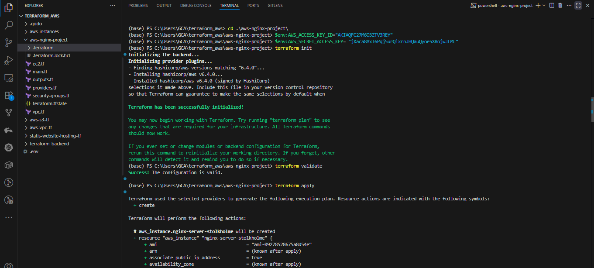
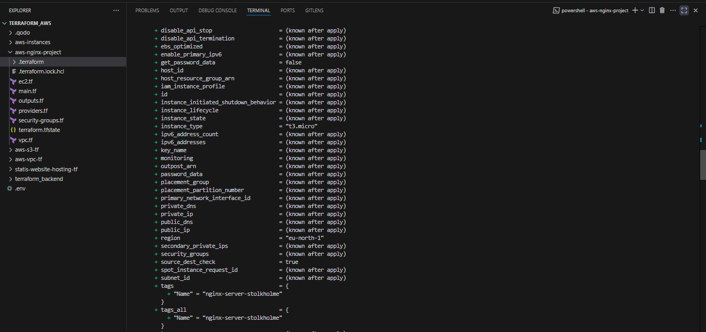
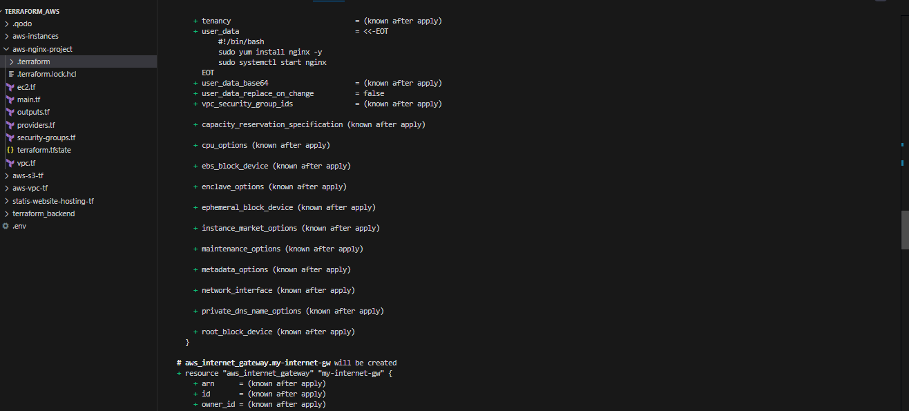
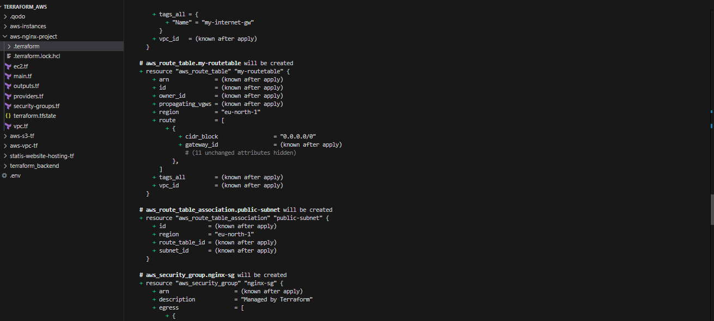
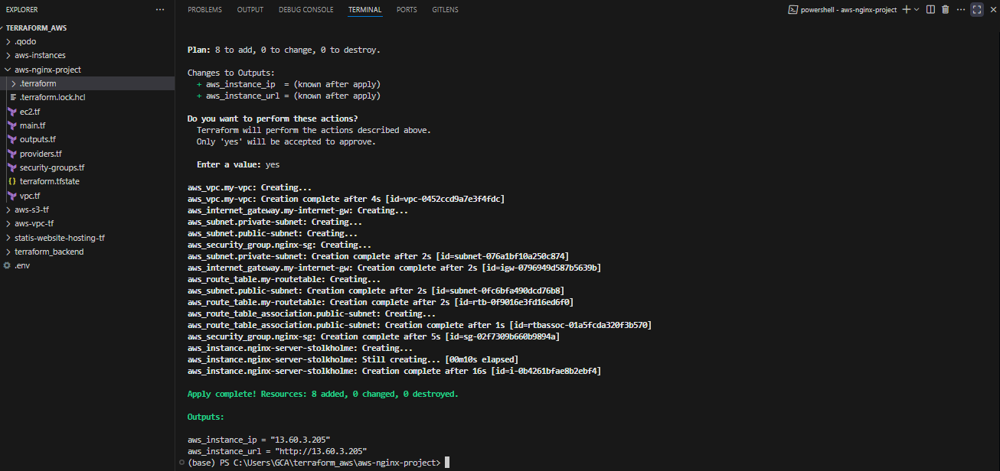
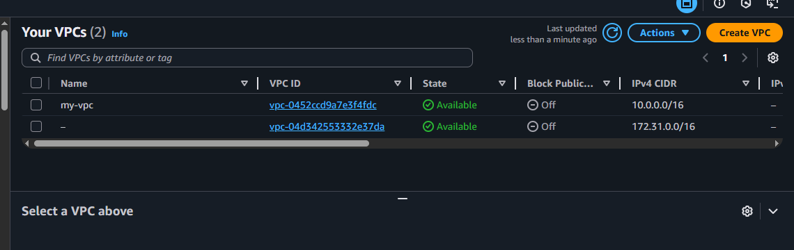
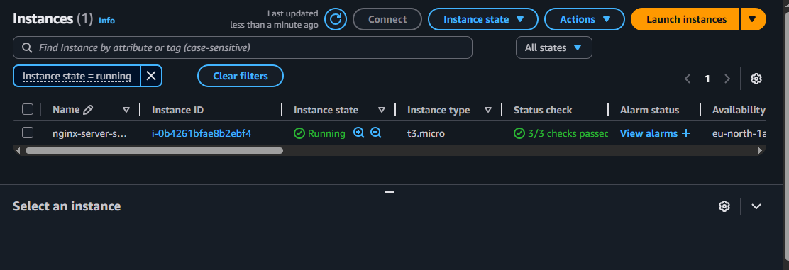
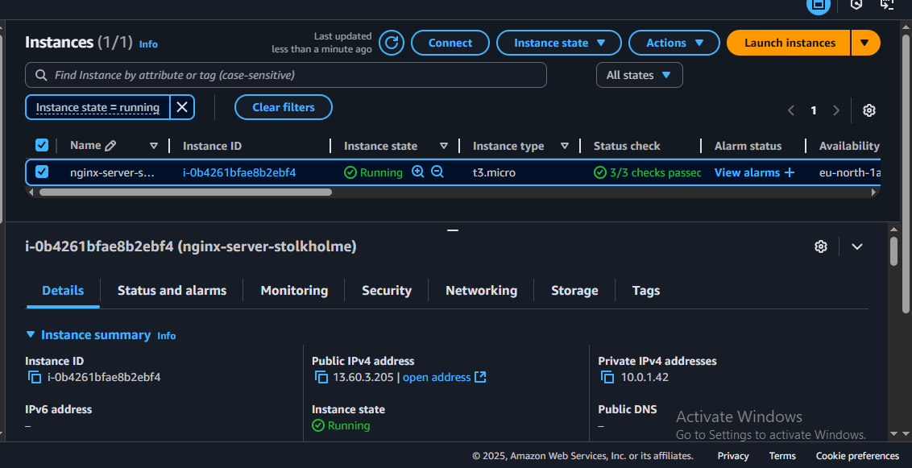

# Terraform AWS NGINX Web Server Deployment

This Terraform configuration creates a complete AWS VPC infrastructure and deploys an NGINX web server on an EC2 instance in the `eu-north-1` region (Stockholm).

## Project Overview

This project provisions a full cloud infrastructure including VPC, subnets, security groups, internet gateway, and routing, then deploys a publicly accessible NGINX web server. The infrastructure is created from scratch, providing a complete isolated network environment.

## Architecture

- **Provider**: AWS (eu-north-1 region - Stockholm)
- **Instance Type**: t3.micro (AWS Free Tier eligible)
- **AMI**: ami-09278528675a8d54e (Amazon Linux 2023)
- **Network**: Custom VPC with public and private subnets
- **Web Server**: NGINX automatically installed and started
- **Access**: Public IP with HTTP access (port 80)

## Infrastructure Components

### Networking
- **VPC**: Custom VPC with CIDR `10.0.0.0/16`
- **Public Subnet**: `10.0.1.0/24` for internet-facing resources
- **Private Subnet**: `10.0.2.0/24` for internal resources
- **Internet Gateway**: Provides internet access to public subnet
- **Route Table**: Routes traffic from public subnet to internet

### Security
- **Security Group**: Allows HTTP (port 80) inbound traffic from anywhere
- **Egress Rules**: Full outbound internet access for updates and package installation

### Compute
- **EC2 Instance**: t3.micro instance with auto-assigned public IP
- **User Data Script**: Automatically installs and starts NGINX service

## Prerequisites

- AWS CLI configured with appropriate credentials
- Terraform installed (compatible with AWS provider 6.4.0)
- AWS account with permissions to create VPC, EC2, and networking resources

## Usage

### 1. Clone and Navigate
```bash
git clone <repository-url>
cd <project-directory>
```

### 2. Initialize Terraform
```bash
terraform init
```

### 3. Plan Deployment
```bash
terraform plan
```

### 4. Apply Configuration
```bash
terraform apply
```
Type `yes` when prompted to confirm the deployment.

### 5. Access Your NGINX Server
After successful deployment, Terraform will output:
- **Public IP**: Direct IP address of your server
- **Server URL**: Complete HTTP URL to access NGINX

Example output:
```
aws_instance_ip = "13.51.xxx.xxx"
aws_instance_url = "http://13.51.xxx.xxx"
```

## Terraform Apply Output

Below are the screenshots showing the Terraform deployment process:


*Initial terraform apply command execution*


*Resource creation progress*


*VPC and networking resources being created*


*EC2 instance and security group creation*


*Final output showing public IP and URL*

## AWS Console Verification

Screenshots from the AWS Management Console showing the created resources:


*VPC and networking components in AWS Console*


*EC2 instance details and status*


*Security group configuration and rules*

## File Structure

```
.
├── main.tf                 # Main Terraform configuration
├── README.md              # This file
└── images/                # Screenshots directory
    ├── terraform-apply-1.png
    ├── terraform-apply-2.png
    ├── terraform-apply-3.png
    ├── terraform-apply-4.png
    ├── terraform-apply-5.png
    ├── aws-console-1.png
    ├── aws-console-2.png
    └── aws-console-3.png
```

## Configuration Details

### Resource Breakdown

#### VPC (`aws_vpc.my-vpc`)
- CIDR Block: `10.0.0.0/16`
- Provides isolated network environment

#### Subnets
- **Public Subnet**: `10.0.1.0/24` - For internet-accessible resources
- **Private Subnet**: `10.0.2.0/24` - For internal resources (future use)

#### Internet Gateway (`aws_internet_gateway.my-internet-gw`)
- Enables internet connectivity for the VPC

#### Route Table (`aws_route_table.my-routetable`)
- Routes all traffic (`0.0.0.0/0`) to the Internet Gateway
- Associated with the public subnet

#### Security Group (`aws_security_group.nginx-sg`)
- **Inbound**: HTTP (port 80) from anywhere (`0.0.0.0/0`)
- **Outbound**: All traffic allowed (for system updates)

#### EC2 Instance (`aws_instance.nginx-server-stolkholme`)
- Deployed in public subnet with public IP
- User data script installs and starts NGINX
- Tagged as "nginx-server-stolkholme"

### User Data Script
```bash
#!/bin/bash
sudo yum install nginx -y
sudo systemctl start nginx
```

## Testing Your Deployment

1. **Check Terraform Outputs**:
   ```bash
   terraform output
   ```

2. **Test HTTP Access**:
   ```bash
   curl http://<your-public-ip>
   ```
   or open the URL in your browser

3. **Expected Response**: NGINX default welcome page

## Cleanup

To destroy all created resources:
```bash
terraform destroy
```
Type `yes` when prompted. This will remove all infrastructure components created by this configuration.

## Cost Considerations

- **t3.micro**: Eligible for AWS Free Tier (750 hours/month for first 12 months)
- **VPC Components**: No additional charges for VPC, subnets, route tables
- **Internet Gateway**: No charges for the gateway itself
- **Data Transfer**: Standard AWS data transfer rates apply

## Security Considerations

⚠️ **Important Security Notes**:
- Security group allows HTTP access from anywhere (`0.0.0.0/0`)
- No HTTPS/SSL configuration (HTTP only)
- No SSH access configured in this setup
- Consider restricting source IP ranges for production use

### Production Recommendations:
- Implement HTTPS with SSL certificates
- Restrict HTTP access to specific IP ranges
- Add SSH access with key pairs for management
- Enable VPC Flow Logs for monitoring
- Use Application Load Balancer for high availability

## Troubleshooting

### Common Issues

1. **Permission Denied**:
   ```bash
   aws sts get-caller-identity  # Verify AWS credentials
   ```

2. **Region-Specific AMI**:
   - AMI `ami-09278528675a8d54e` is specific to eu-north-1
   - Update AMI ID if deploying to different regions

3. **NGINX Not Accessible**:
   - Check security group rules
   - Verify instance is in public subnet
   - Confirm public IP assignment

### Validation Commands
```bash
# Check VPC
aws ec2 describe-vpcs --filters "Name=tag:Name,Values=my-vpc" --region eu-north-1

# Check instance status
aws ec2 describe-instances --filters "Name=tag:Name,Values=nginx-server-stolkholme" --region eu-north-1

# Test connectivity
curl -I http://<public-ip>
```

## Extending This Project

### Possible Enhancements:
- Add Application Load Balancer for high availability
- Implement Auto Scaling Group
- Add RDS database in private subnet
- Configure CloudWatch monitoring
- Add SSL/TLS termination
- Implement CI/CD pipeline

## Contributing

1. Fork the repository
2. Create a feature branch (`git checkout -b feature/enhancement`)
3. Make your changes
4. Test the configuration thoroughly
5. Submit a pull request

## License

This project is licensed under the MIT License - see the LICENSE file for details.

---

**Author**: Your Name  
**Last Updated**: $(date)  
**Terraform Version**: Compatible with v1.0+  
**AWS Provider Version**: 6.4.0
